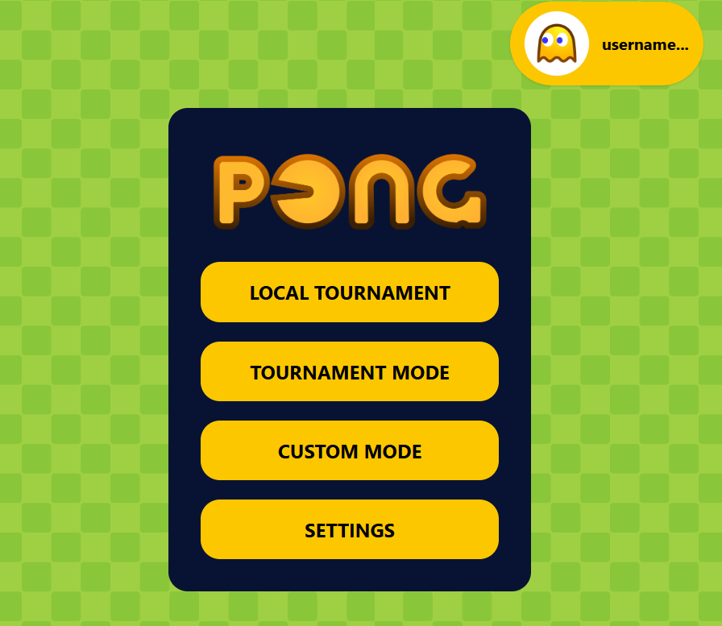

# ft_transcendence 🏓

A full-stack, multiplayer Pong web application developed collaboratively by a team of 5 at 42 School.

---

## 📸 Screenshots

### Game Previews

| Title Screen | Lobby | Game |
| :---: | :---: | :---: |
|  |  |  |

---

## ✨ Features

- 🎮 **Game Modes**
  - Local Tournament (up to 4 players on one machine)
  - Online Tournament (real-time multiplayer via WebSocket)
  - Custom Mode (configure ball speed, winning score, and more)
- 👤 **Authentication**
  - Register & login with username/password
  - Google OAuth 2.0 sign-in
  - Two-Factor Authentication (2FA) via OTP
- 🧑‍🤝‍🧑 **Social Features**
  - Friend requests & friend list
  - Block users
  - Real-time online status
  - Live chat with friends
- 🌍 **Internationalization** — English, Simplified Chinese, Traditional Chinese
- 📊 **Profiles** — Avatar, stats, match history, medals
- 🔒 **Security** — JWT-based sessions, bcrypt password hashing

---

## 🛠️ Tech Stack

| Layer     | Technology                              |
|-----------|-----------------------------------------|
| Frontend  | React, TypeScript, Vite, TailwindCSS    |
| Backend   | Fastify, TypeScript, Prisma, SQLite     |
| Real-time | WebSockets (`@fastify/websocket`, `ws`) |
| Auth      | JWT, Google OAuth 2.0, 2FA              |
| Proxy     | Nginx (HTTPS + HTTP)                    |
| Container | Docker, Docker Compose                  |

---

## 👩🏻‍💻 Team
[Khai Kit](https://github.com/exellaz)
- Engineered the reverse proxy infrastructure using Nginx to handle secure routing and SSL termination.
- Implemented robust User Authentication (OAuth2/JWT) to ensure secure user sessions.

[Eu Ting](https://github.com/et-learns-to-code)
- Designed and developed the user interface, focusing on interactive frontend components.
- Built the real-time chat system and friendship management features using WebSockets.

[Samuel](https://github.com/samueltingg)
- Developed the core RESTful API endpoints, managed the database architecture.
- Implemented a live heartbeat system to track real-time user online status.

[Sheldon](https://github.com/Sheldon-Chong)
- Architected the core game logic and physics engine, ensuring low-latency server-side rendering or synchronization for the multiplayer Pong matches.

[Low](https://github.com/wenjuin95)
- Bridged the gap between the frontend and backend to ensure seamless data flow.
- Implemented the core tournament system and dynamic game room creation algorithms.

---

## 🚀 Getting Started

### Prerequisites

- Docker
- Docker Compose

### 1. Clone the repository

```bash
git clone https://github.com/wenjuin95/trancendence.git
cd trancendence
```

### 2. Configure environment variables

```bash
cp .env.example .env
```

### 3. Start the application

```bash
docker compose up --build
```

### 4. Open https://localhost:8443 in your browser.

> **Note:** A self-signed certificate is generated automatically for local HTTPS. Your browser may show a security warning — this is expected in development.

---

## 📄 License

This project was created for educational purposes as part of the [42 School](https://42.fr) curriculum.
